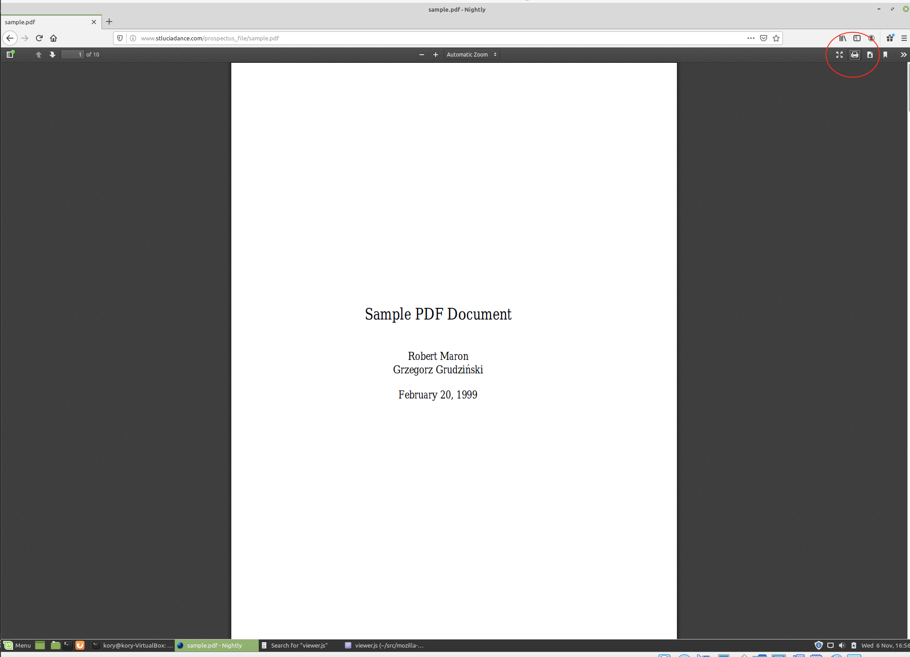

_Bug URL:_ https://bugzilla.mozilla.org/show_bug.cgi?id=836732

_PR URL:_ https://github.com/Kory-McLean/gecko-dev/pull/1

_Patch File URL:_ https://github.com/Kory-McLean/gecko-dev/blob/Bug-836732_fix/docs/836732.patch

**Bug Diagnosis:**

This bug occurs when a user is viewing a PDF using Firefox. When clicking the print button located on the toolbar on top of the page, the button is focused and becomes the active element. When a button on the tool bar is focused and the active element then it appears in the hover state as described in the bug posting. After a printing dialogue will appear. If the user chooses to click 'Cancel' on the dialogue it will close and the user is able to view the PDF again. However, after this the print button is still focused and the active element. Upon further investigation and from the comments underneath the bug posting it is appearant that this occurs with all buttons on the toolbar. The benefit of fixing this issue is that it will increase the consistency of the UI and allow the UI to better reflect the current state of the application as by removing the focus we are able to convey to the user that no buttons are being clicked therefore their actions are not being executed. The risk present is that when working with javascript which is implemented to execute actions,  utilize dialogues and other services we need to be cautious about race conditions.

**Bug Solution:**

Though the bug posting mentions the bug is present in pdf.js, after my investigations I found that the bug can be fixed by changing viewer.js.My proposed and implemented solution for this is to add code to the 'click' event listeners for the toolbar buttons which will unfocus the respective toolbar button. I do this by making a call to blur() on the buttons element which will unfocus it. I placed this call to blur() inside of a if statement which ensures that the documents active element is equal to the clicked toolbar button. This is to avoid us calling blur() on the button if it is not the active element (ie if it is not focused). I did consider iterating over all the toolbar items and adding a new event listener which calls blur(), but since these buttons execute actions, utilize dialogues and other services when clicked, we want to call blur() after the buttons intended functionality is executed.

**Testing:**

To test my bug solution I executed the steps to reproduce the bug as posted in the posting and checked for desired outcomes. 

The steps are:
- Run `'./mach build'` to verify that the project builds successfully.
- Run `'./mach test'` to verify all the automated tests are passing.
- Go to 'http://www.stluciadance.com/prospectus_file/sample.pdf' or any url in which a pdf is displayed.
- Click the print button on the toolbar at the top.
- Click cancel on the print dialogue when it appears.
- The print button should now NOT be in the hover state.

**Screen shots:**

Below are some screenshots showing the changes viewed after clicking cancel on the print dialogue:

_Before my solution:_

_After my solution:_

